# ▶ 開發者協作者使用流程

## 1 概述

開發者協作者帳號為開發者用戶所創建。開發者協助者通過開發者創建帳號時設定的用戶名和密碼即可於TTFGame平臺首頁進行登錄。同時，開發者協作者對大部分頁面僅有查看許可權，關於這些頁面的詳細說明請參見各頁面介紹中對這些頁面的說明，此部分中不再贅述。

## 2 帳號註冊與過審

開發者協作者帳號不需要註冊，請向需要協作的開發者使用者索要登錄平臺所使用的用戶名與密碼。

新帳號登錄平臺時，會因為帳號未審核進入控制台頁面時收到提示，點擊“立即前往完善資料”即會跳轉至帳號資訊頁面。

帳號資訊頁面中使用者需要編輯自己的企業名稱，企業簡介。完善資訊後點擊下方的確定按鈕後即發起了審核申請，待管理員確認審核資訊後，會通過發送公告的方式給出相應的審核結果與審核建議，審核未通過時請根據審核建議重新提交審核，審核通過後用戶即可開始正式使用TTFGame平臺。

## 3 修改密碼

通過審核後重新登錄後，使用者會來到控制台頁面，使用者可以通過點擊左側的巡覽列在在各個頁面間進行切換。點擊左側巡覽列中的“修改密碼”進入修改密碼介面。

在密碼欄和確認密碼欄連續輸入同樣的新密碼後點擊“確定”即修改密碼成功，點擊“重置”則放棄修改繼續使用修改前的密碼。特別的，在本頁面修改密碼後使用者會被強制退出平臺，請使用新密碼重新進行登錄。

# ▶ 遊戲開發

## 1 添加遊戲

開發者以及協作者都可進行添加遊戲操作，用戶可以通過點擊左側的巡覽列點擊遊戲管理欄將其展開，再在展開部分中選擇遊戲管理進行添加遊戲與發佈操作。

遊戲管理頁面預設沒有遊戲，使用者點擊該頁面上方的添加按鈕即可為自己的平臺添加遊戲。

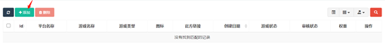

可添加的欄位如下：

遊戲名稱：預設值為空，該欄位代表新創建遊戲的遊戲名稱。如不填寫則會提示“遊戲名稱不能為空”導致添加失敗。

官方連結：預設值為空，該欄位代表新創建遊戲的官方連結。如不填寫則會提示“官方連結不能為空”導致添加失敗。如不填寫有效的URL位址則會提示“連結不是有效的URL位址”導致添加失敗。**這裡地址必須是遊戲入口實際地址。**

遊戲類型：該欄位代表新創建遊戲的遊戲類型，使用者需要下拉式功能表中從全平臺公有的遊戲類型和遊戲所屬平臺專有的遊戲類型中選擇任一類型。

APP類型：預設值為H5，該欄位代表新創建的遊戲的APP類型，僅能在H5和APP兩個選項中進行選擇。**只有選擇H5的時候可以直接進入遊戲，否則將會跳轉到流覽器頁面展示官方連結位址。**

重要標籤：預設值為熱門、最新、推薦三個標籤均為未添加狀態，該欄位代表新創建的遊戲所使用的重要標籤，通過點擊對應標籤可以添加對應的重要標籤。允許不添加或添加一到多個重要標籤。

標籤：預設值為空，可以手動輸入或在全平臺公有的標籤和遊戲所屬平臺專有的標籤中進行選擇。該欄位代表新創建的遊戲三個重要標籤外使用的其他標籤，允許不添加或添加一到多個。

圖示：預設值為空。該欄位代表所創建遊戲所使用的圖示，使用者可點擊右側上傳按鈕上傳圖片或直接填入圖片連結位址。上傳圖片尺寸需為512\*512px,格式必須為JPG或PNG，若不符合要求則會出現報錯提示。如不添加則會提示“圖示不能為空”導致添加失敗。

推廣圖：預設值為空。該欄位代表所創建遊戲主要作為遊戲詳情頁置頂圖所使用的推廣圖，用戶可點擊右側上傳按鈕上傳圖片或直接填入圖片連結位址。上傳圖片尺寸需為1024\*500px,格式必須為JPG或PNG，若不符合要求則會出現報錯提示。如不添加則會提示“推廣圖不能為空”導致添加失敗。

遊戲狀態：預設值為開放，該欄位代表新創建的遊戲的遊戲狀態，僅能在開放、敬請期待、預約和測試四個選項中進行選擇。**其中，只有開放狀態可以在使用者用戶端App中看到，而測試狀態可以在測試用戶端App中看到。敬請期待和預約暫時都未在用戶端展示。**

是否橫屏：預設值為否，該欄位代表新創建遊戲是否為橫屏遊戲，點擊即可切換為是。**這是是否在App端橫屏展示遊戲的唯一依據。**

簡介：預設值為空，該欄位代表新創建遊戲的簡介，如不填寫則會提示“簡介不能為空”導致添加失敗。

遊戲詳情：預設值為空，該欄位代表新創建遊戲的遊戲詳情，如不填寫則會提示“遊戲詳情不能為空”導致添加失敗。

截圖：預設值為空。該欄位代表所創建遊戲的截圖，至少需要上傳5場或以上，用戶可點擊右側上傳按鈕上傳圖片或直接填入圖片連結位址（填入多個位址時中間需要以逗號分隔）。上傳圖片的建議尺寸為橫板遊戲1280\*720px以上，豎板遊戲720\*1280px以上,格式必須為JGP或PNG，若不符合要求則會出現報錯提示。如不添加則會提示“截圖不能為空”導致添加失敗。如上傳圖片數量不足則會提示“上傳圖片數量不足5張”導致添加失敗。

所有資訊填寫完畢後點擊“確認”即完成添加，點擊重置則會清空該頁面所有已填寫資訊。

添加成功後，遊戲為未開放待審核狀態。協作者管理頁面即會增加一行新的遊戲資訊。點擊改行資訊最右側的操作按鈕可對該資訊進行詳情查看，審核資訊查看，編輯和刪除。

## 2 遊戲開發

遊戲接入平臺，需要對接平臺SDK。

在申請開發者成功後，在後臺獲得對應的[SDK文檔以及開發說明](https://d_docs.ttfgame.top ':target=_blank') 。

添加遊戲成功後，點擊操作——遊戲資訊按鈕，可以查看遊戲的參數，根據開發文檔的指引，完成SDK對接。**此時請保證遊戲狀態為 “測試”。**

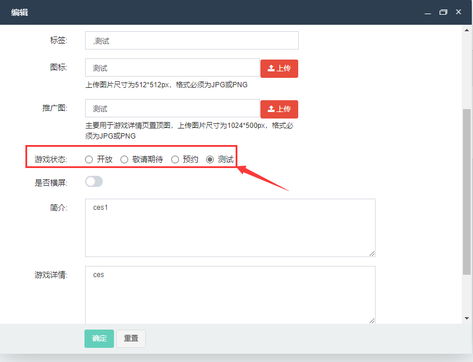

完成SDK對接開發，並完成遊戲功能以及版本測試後，可修改遊戲狀態為“開放”並提交遊戲等待審核。

## 3 遊戲審核

遊戲提交以後，將自動進入待審核狀態，需要開發者或者更高許可權的管理員進行審核以後，才能進行發佈。如果審核未通過，請點擊“審核詳情”按鈕查看“審核建議”確定未通過的原因，並進行相應的修改，再次提交審核。

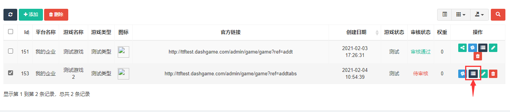

## 4 遊戲發佈

等待審核通過後，審核狀態由待審核變為審核通過並額外增加發佈按鈕，點擊即可進行遊戲發佈，對已發佈的遊戲再次點擊即為遊戲撤回重新變為未發佈狀態。

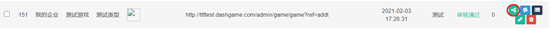

遊戲發佈後，將正式對外開放，開發者需要關注遊戲運營狀況，即時優化問題，給用戶帶來高品質的娛樂體驗。

 

# ▶ 各頁面介紹

## 1 控制台

初始頁面。通過本頁面可獲取許可權許可內的即時資料和當前的伺服器資訊。

同時，也支持進行流覽量與啟動量的查詢並生成相對應的圖表。

## 2 修改密碼

該頁面中使用者可以修改新的登錄密碼。

## 3 遊戲管理

開發者可使用遊戲管理下的所有頁面。開發者協作者僅可使用遊戲管理下的部分頁面。

### 3.1 遊戲管理

該頁面所有平臺使用者皆可使用。通過本頁面使用者可查看管理遊戲資訊。

開發者與開發者協作者僅可查看管理該帳號下的遊戲資訊，同時支援對這些遊戲的發佈與撤回。

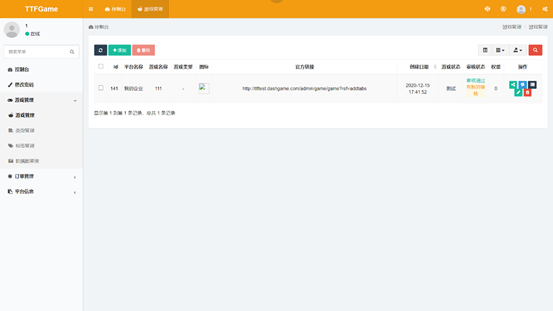

### 3.2 類型管理

該頁面所有平臺使用者皆可使用。通過本頁面使用者可查看管理遊戲類型資訊。

開發者僅可查看管理該帳號下遊戲的類型資訊。

開發者協作者僅可查看自己所協作的開發者的平臺的遊戲的遊戲類型資訊，不支援添加，修改和刪除。

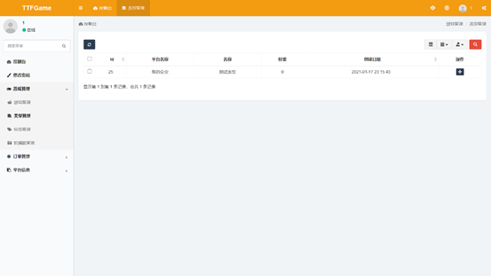

### 3.3 標籤管理

該頁面所有平臺使用者皆可使用。通過本頁面使用者可查看遊戲標籤資訊，不支援添加，修改和刪除。

開發者與開發者協作者僅可查看該帳號下遊戲的遊戲標籤資訊。

### 3.4 輪播圖管理

該頁面所有平臺使用者皆可使用。通過本頁面使用者可查看管理輪播圖資訊。

開發者僅可查看管理該帳號下遊戲的輪播圖資訊。

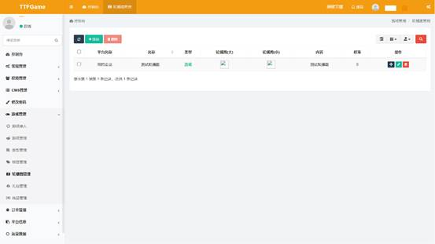

開發者協作者僅可查看自己所協作的開發者的遊戲的輪播圖資訊，不支援添加，修改和刪除。

## 7 訂單管理

開發者和開發者協作者僅可使用訂單管理下的部分頁面。訂單管理下的所有頁面均只支援使用者查看或搜索，不支援添加修改和刪除操作。

### 7.1 遊戲充值訂單

本頁面所有使用者均可使用。通過本頁面使用者可查看遊戲充值訂單資訊。

開發者與開發者協作者僅能查看該帳號下的遊戲充值訂單資訊。

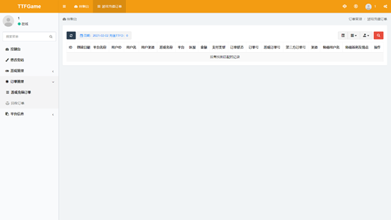

### 7.2 回收訂單

本頁面所有使用者均可使用。通過本頁面使用者可查看回收訂單資訊。

開發者與開發者協作者僅能查看該帳號下的回收訂單資訊。

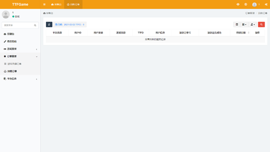

## 8 平臺資訊

開發者和開發者協作者僅可使用平臺資訊下的部分頁面。

### 8.1 平臺通知

本頁面所有使用者均可使用。通過本頁面使用者可以查看與管理平臺通知，同時支援使用者根據許可權的不同進行平臺通知的發送或接收操作。

開發者與開發者協作者可通過本頁面接收平臺通知。開發者使用本頁面僅支援搜索，不支援添加，修改與刪除操作。

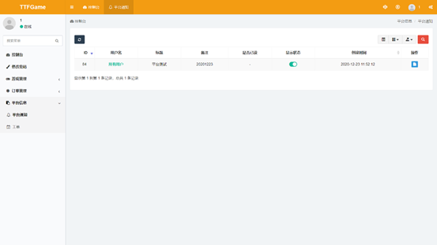

### 8.2 工單

本頁面所有使用者均可使用。因目前系統不支援處理工單，用戶需點擊“前往工單系統”按鈕跳轉至新的系統中繼續進行操作。

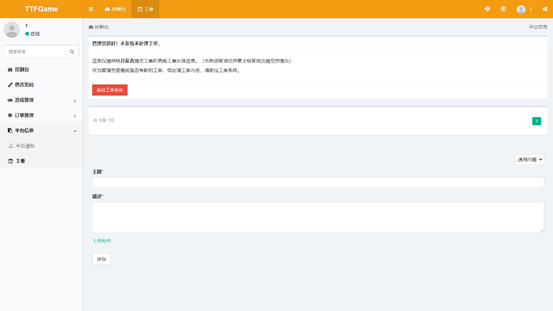

