▶ 开发者使用流程

## 1 概述

通过注册账号进入TTFGame开放平台并成功通过审核的用户默认权限即为开发者，其大部分流程与开发者协作者使用流程相同。若想了解开发者的所有权限支持功能请参照各页面介绍，下文仅对本平台支持开发者的几项主要功能进行说明。

## 2 账号注册与过审

第一次使用TTFGame的用户可以通过在平台首页点击“没有账号？立即注册”按钮进入账号注册页面。

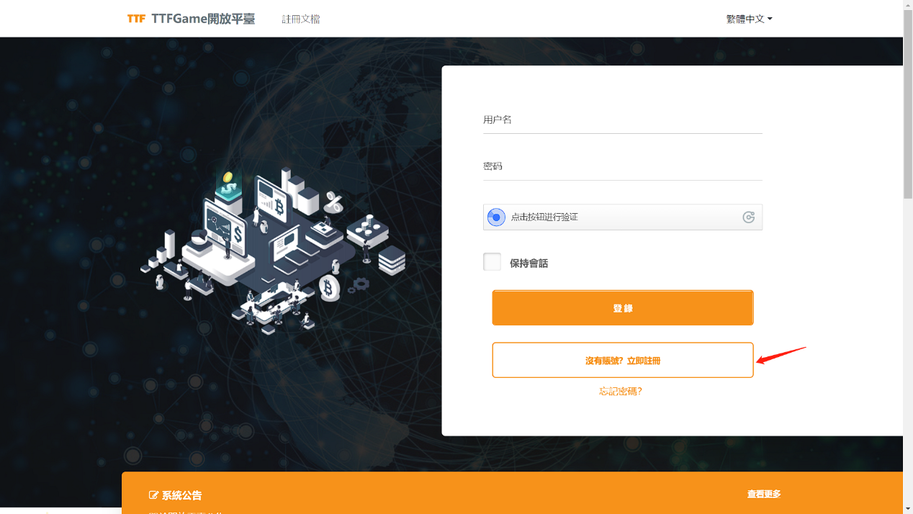

注册页面中，点击最下方《TTFGame开放平台协议》可进行阅读，阅读结束后若接受协议请点击单选框打勾，否则无法完成注册。完善邮箱，手机和密码信息并空格按钮验证后，点击验证码右侧的发送按钮，系统将会发送一封验证邮件至所填写的手机。在验证码一栏输入验证邮件附带的验证码后，点击注册按钮即可完成账号注册。

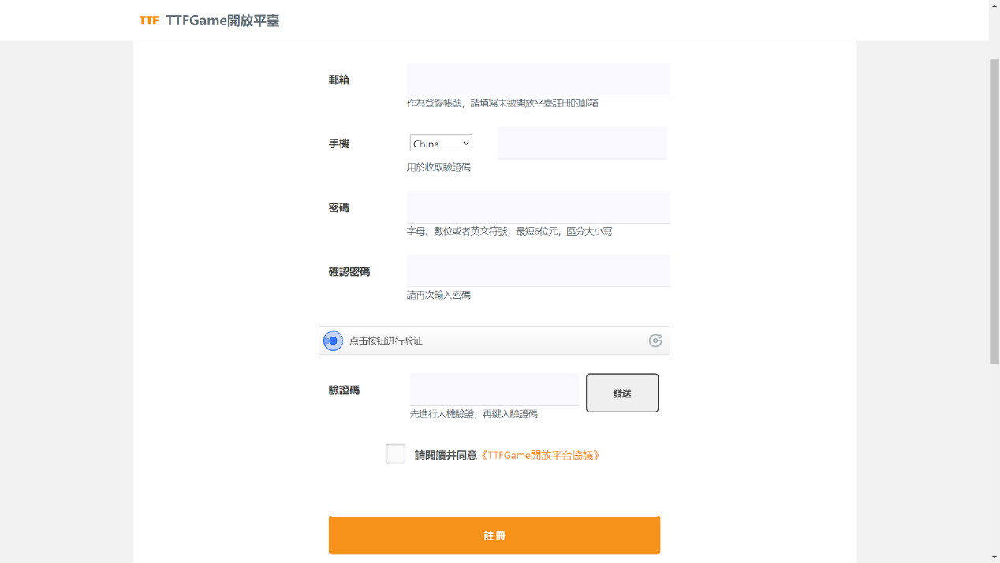

注册账号结束后，用户可使用注册时的邮箱为用户名配合密码于平台首页登录TTFGame平台。

开发者账号的过审流程与开发者协作者完全相同，详情请参阅开发者协作者使用流程中的第2部分“账号注册与过审”后半段。

## 3 个人配置与修改密码

点击常规管理栏将其展开，再在展开部分中选择个人配置进入个人配置页面。

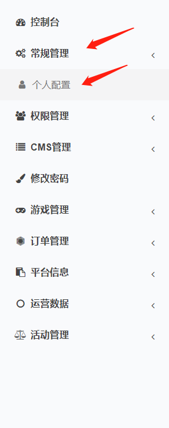

个人配置页面中，支持用户对邮箱地址，包体下载，昵称和密码进行修改。修改结束后点击下方“提交”按钮保存并应用修改，点击“重置”按钮则不保存本次修改重置回修改前的状态。特别的，若用户不想对密码进行修改，请保持密码栏留空。

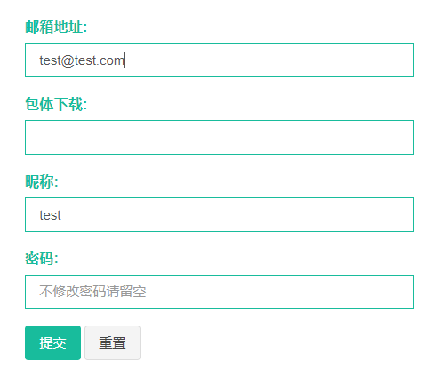

同时，修改密码页面也支持用户进行密码的修改。开发者账号的修改密码流程与开发者协作者完全相同，详情请参阅开发者协作者使用流程中的第3部分“修改密码”。

## 4 协作者与测试账号管理

用户可以通过点击左侧的导航栏点击权限管理栏将其展开，再在展开部分中选择协作者管理查看和管理开发者协作者或选择测试账号查看和管理测试账号。

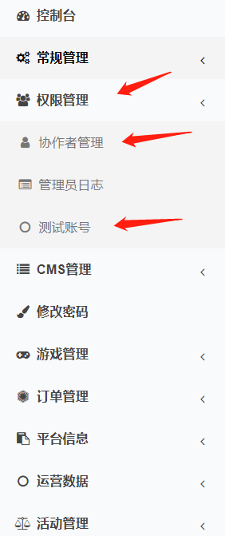

协作者管理页面默认只有开发者管理员（即用户自己）一个账号，用户点击该页面上方的添加按钮即可为自己的平台添加开发者协作者账号。

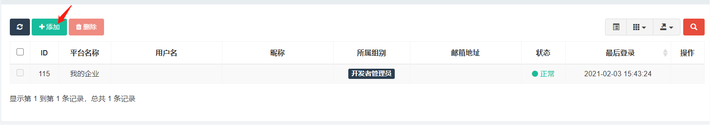

添加页面中，可添加的字段如下：

所属组别：默认值为“没有选中任何项”，下拉菜单中仅能选择协作者1个选项。该字段代表新创建用户的所属组别，用户会根据所属组别得到对应的权限。若不选择任何项则会提示“所属组别不能为空”导致添加失败。

用户名：默认值为空，该字段代表新创建用户的用户名。如不填写则会提示“用户名不能为空”导致添加失败。

邮箱地址：默认值为空，该字段代表新创建用户的邮箱地址。如不填写则会提示“邮箱地址不能为空”导致添加失败。

昵称：默认值为空，该字段代表新创建用户的昵称。如不填写则会提示“昵称不能为空”导致添加失败。

密码：默认值为空，该字段代表新创建用户的密码。如不填写则会提示“密码不能为空”导致添加失败。

权限分级：默认值为空，用户需要在会员管理、实时数据、游戏汇总、用户留存、法币汇总5种权限中勾选一项或多项所添加的用户能查看的权限。

选择游戏：默认值为空，用户可通过在该字段中勾选所需游戏，为新增角色增加需要协作管理的游戏。

状态：默认值为正常，该字段代表新创建的用户的状态，仅能在正常和隐藏2个选项中进行选择。

所有信息填写完毕后点击“确认”即完成添加，点击重置则会清空该页面所有已填写信息。

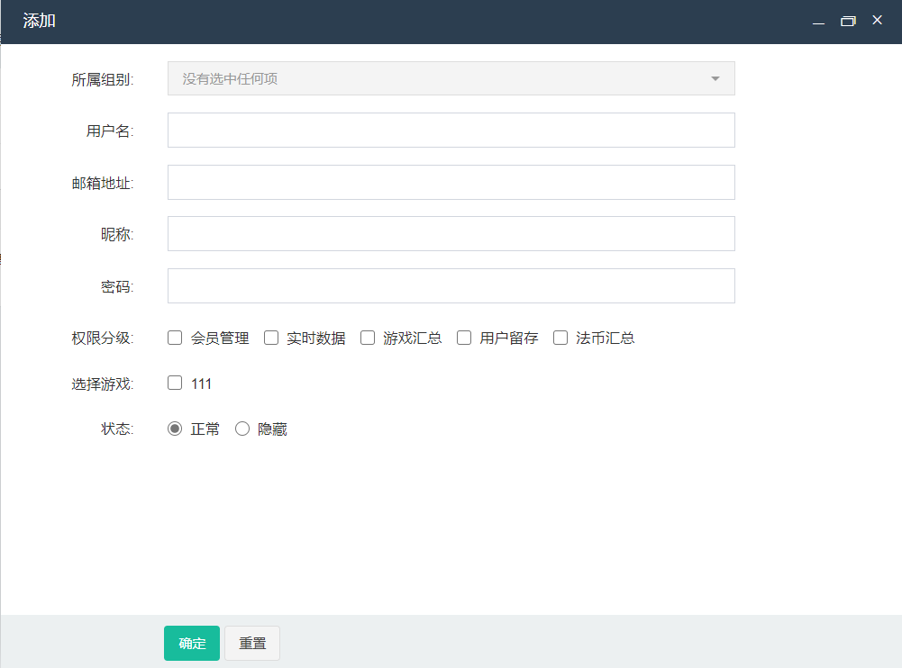

添加成功后，协作者管理页面即会增加一行新的协作者信息。点击该行信息最右侧的操作按钮可对该信息进行修改或删除。

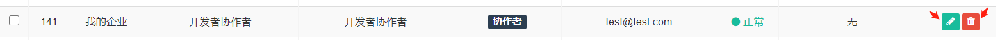

点击绿色的修改按钮后，进入编辑页面，可修改字段除以下两点外，字段含义和限制均与可添加字段中对各字段的介绍相同：

1、各字段默认值为要修改的协作者添加时用户填入或选择的值。

2、增加可供修改的新字段登录失败次数：默认值为0，仅允许填入数字，修改为小于0的数字保存后会自动重置回0。该字段代表用户登录失败的次数。修改登录失败次数则能有效的避免登录失败次数过多造成的登录警告等情况的发生。

修改结束后后点击“确认”即完成修改，点击重置则会将所有已修改信息重置为修改前状态。

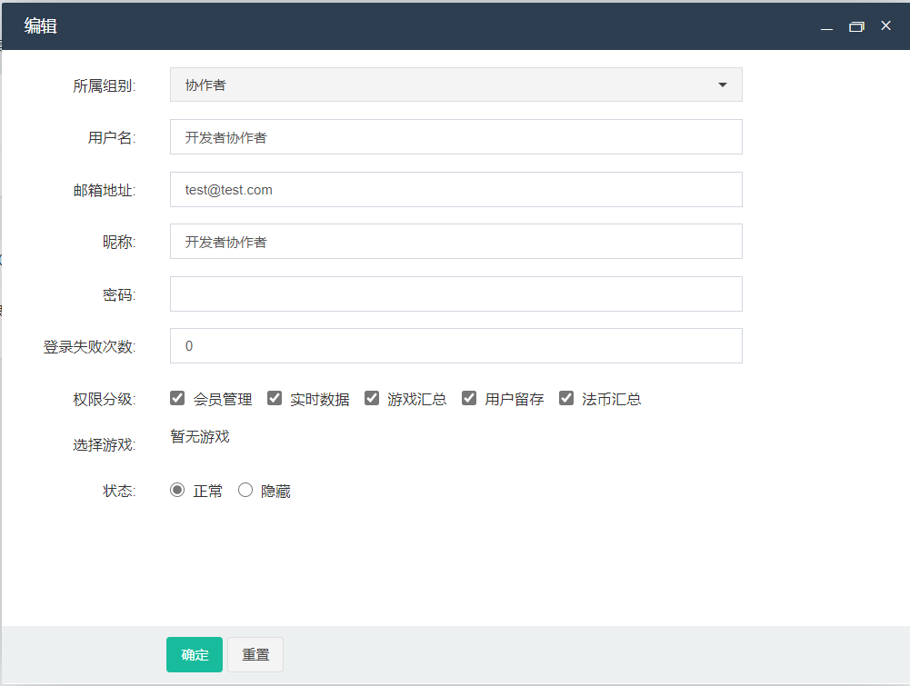

点击删除则会出现提示窗口进行确认，点击确定即可删除所选协作者的账号，点击取消则会取消这次删除。

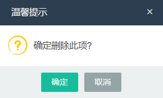

测试账号页面默认没有测试账号，用户点击该页面上方的添加按钮即可为自己的平台添加测试账号。

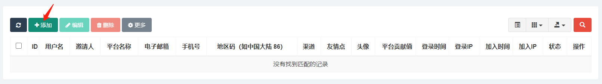

点击添加按钮打开添加页面，在打开的添加页面中完善信息后点击添加页面最下方的确定按钮即可完成添加。

**必填字段如下：**

用户名：默认值为系统自动生成，不可修改，该字段代表新创建的测试账号的用户名。

昵称：默认值与用户名相同，该字段代表要修改的测试账号的昵称。如不填写则会提示“昵称不能为空”导致修改失败。

**可添加的字段如下：**

密码：默认值为空，该字段代表新创建的测试账号的密码。**建议填写，用于测试账号在开放平台版测试客户端登录。**

电子邮箱：默认值为空，该字段代表新创建的测试账号使用者的电子邮箱。

手机号：默认值为空，该字段代表新创建的测试账号使用者的手机号。**建议填写，用于测试账号在开放平台版测试客户端登录。**

手机地区码：默认值为空，该字段代表新创建的测试账号使用者的手机地区码。**开放平台版测试客户端登录必须一致。**

头像：默认值为空，该字段代表新创建的测试账号的头像。用户可点击右侧上传按钮上传图片或直接填入图片链接地址。

等级：默认值为空，该字段代表新创建的测试账号的等级。

性别：默认值为男，该字段代表新创建的测试账号使用者的性别，仅能在男和女两个选项中进行选择。

生日：默认值为空，该字段代表新创建的测试账号使用者的生日，仅支持填写标准日期格式。

格言：默认值为空，该字段代表新创建的测试账号使用者的格言。

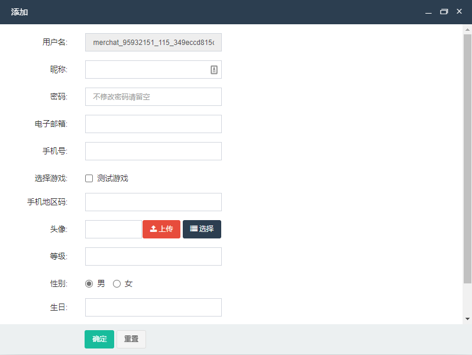

添加成功后，协作者管理页面即会增加一行新的测试账号信息。点击改行信息最右侧的操作按钮可对该信息进行修改或删除。

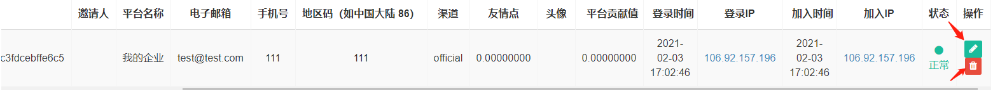

点击绿色的修改按钮后，进入编辑页面，**必填字段如下：**

用户名：默认值为系统自动生成，不可修改，该字段代表新创建的测试账号的用户名。

昵称：默认值与用户名相同，该字段代表要修改的测试账号的昵称。如不填写则会提示“昵称不能为空”导致修改失败。

**可修改的字段如下：**

密码：默认值为空（即使要修改的测试账号确实拥有原密码），该字段代表要修改的测试账号的密码。如不填写则会维持原密码不进行修改。

电子邮箱：默认值为添加时用户所填写的电子邮箱，该字段代表要修改的测试账号使用者的电子邮箱。

平台名称：该字段代表有修改的测试账号所属的平台，用户需在下拉菜单的所有平台中任选一个平台。

手机号：默认值为添加时用户所填写的手机号，该字段代表要修改的测试账号使用者的手机号。

手机地区码：默认值为添加时用户所填写的手机地区码，该字段代表要修改的测试账号使用者的手机地区码。

头像：默认值为添加时用户所选择的头像，该字段代表要修改的测试账号的头像。用户可点击右侧上传按钮上传图片或直接填入图片链接地址添加图片，点击图片下方的红色垃圾桶图标删除图片。

等级：默认值为添加时用户所填写的等级，该字段代表要修改的测试账号的等级。

性别：默认值为添加时用户所选择的性别，该字段代表要修改的测试账号使用者的性别，仅能在男和女两个选项中进行选择。

生日：默认值为添加时用户所填写的生日，该字段代表要修改的测试账号使用者的生日，仅支持填写标准日期格式。

格言：默认值为添加时用户所填写的格言，该字段代表要修改的测试账号使用者的格言。

余额：默认值为0.00，仅允许填入数字，修改为小于0的数字保存后会自动重置回0。该字段代表要修改的测试账号的余额。如不填写则会提示“余额不能为空”导致修改失败。

连续登录天数：默认值为0，仅允许填入数字，修改为小于0的数字保存后会自动重置回0。该字段代表要修改的测试账号的连续登录天数。如不填写则会提示“连续登录天数不能为空”导致修改失败。

最大连续登录天数：默认值为0，仅允许填入数字，修改为小于0的数字保存后会自动重置回0。该字段代表要修改的测试账号的最大连续登录天数。如不填写则会提示“最大连续登录天数不能为空”导致修改失败。

上次登录时间：默认值为1970-01-01
08:00:00，该字段代表要修改的测试账号的上次登录时间，仅支持填写标准日期格式。如不填写则会提示“上次登录时间不能为空”导致修改失败。

登录时间：默认值为测试账号的创建时间，该字段代表要修改的测试账号的登录时间，仅支持填写标准日期格式。如不填写则会提示“登录时间不能为空”导致修改失败。

登录IP：默认值为测试账号注册时用户使用的IP地址，该字段代表要修改的测试账号的登录IP。如不填写则会提示“登录IP不能为空”导致修改失败。

失败次数：默认值为0，仅允许填入数字，修改为小于0的数字保存后会自动重置回0。该字段代表要修改的测试账号的登录失败次数。如不填写则会提示“失败次数不能为空”导致修改失败。

加入IP：默认值为测试账号注册时用户使用的IP地址，该字段代表要修改的测试账号的加入IP。如不填写则会提示“加入IP不能为空”导致修改失败。

加入时间：默认值为测试账号的创建时间，该字段代表要修改的测试账号的登录时间，仅支持填写标准日期格式。如不填写则会提示“加入时间不能为空”导致修改失败。

屏蔽回收：默认值为否，该字段代表要修改的测试账号是否屏蔽回收，点击即可切换为是。

是否封号：默认值为否，该字段代表要修改的测试账号是否被封号，点击即可切换为是。  
状态：默认值为添加时用户所选择的状态，该字段代表要修改的测试账号的状态，仅能在正常和隐藏2个选项中进行选择。

修改结束后后点击“确认”即完成修改，点击重置则会将所有已修改信息重置为修改前状态。

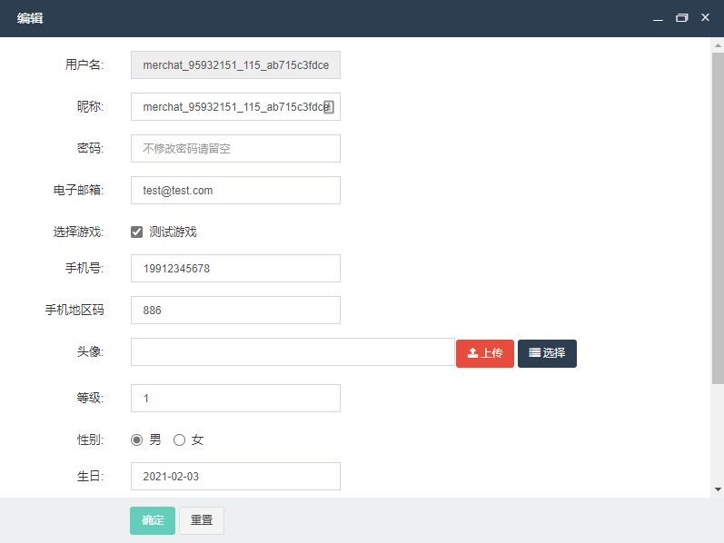

点击删除则会出现提示窗口进行确认，点击确定即可删除所选协作者的账号，点击取消则会取消这次删除。

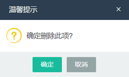

同时，会员管理页面也支持对测试账号信息进行查看与管理。会员管理页面进入方法为展开运营数据，点击会员管理。

会员管理页面不支持添加操作，仅支持对已有的测试账号进行修改与删除，具体流程与测试账号页面的修改与删除流程一致。

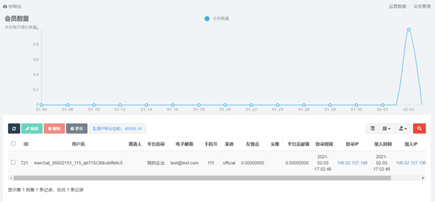

## 5 添加游戏与发布

开发者账号的游戏创建与发布流程与开发者协作者大致相同，详情请参阅开发者协作者使用流程中的第4部分“游戏创建与发布”。

唯一不同之处为开发者支持对游戏进行审核操作，点击审核按钮进入审核页面。

审核详情页面中出现的字段如下：

游戏名称：该字段代表要审核的游戏的名称，仅供查看无法修改。

官方链接：该字段代表要审核的游戏的官方链接，仅供查看无法修改。

游戏类型：该字段代表要审核的游戏的类型，仅供查看无法修改。  
APP类型：该字段代表要审核的游戏的APP类型，仅供查看无法修改。

标签：该字段代表要审核的游戏的标签，仅供查看无法修改。

图标：该字段代表要审核的游戏的图标，仅供查看无法修改。

推广图：该字段代表要审核的游戏的推广图，仅供查看无法修改。

是否横屏：该字段代表要审核的游戏是否横屏，仅供查看无法修改。

游戏状态：该字段代表要审核的游戏的状态，仅供查看无法修改。

简介：该字段代表要审核的游戏的简介，仅供查看无法修改。

游戏详情：该字段代表要审核的游戏的详情，仅供查看无法修改。

截图：该字段代表要审核的游戏的截图，仅供查看无法修改。

状态：默认值为待审核，该字段代表要审核的游戏的审核状态，仅能在待审核、审核通过、审核未通过3个选项中进行选择。

审核建议：默认值为空，该字段代表此次审核中将发送给要审核的游戏所属平台的审核建议。如不填写则会提示“审核建议不能为空”导致审核失败。

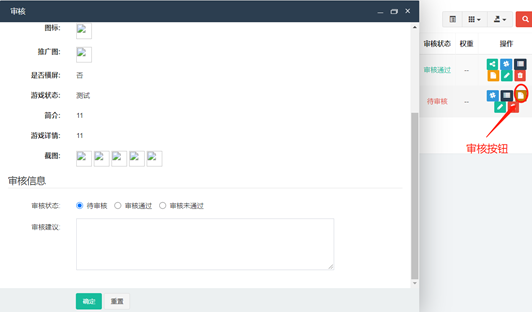

用户可以通过在该页面改变审核状态的方式来表明审核结果，修改审核状态并填写审核建议后点击审核详情最下方的确定按钮即保存审核结果。

## 6 CMS内容管理与单页管理

用户可以通过点击左侧的导航栏点击CMS管理栏将其展开，再在展开部分中选择内容管理查看和管理CMS内容或单页查看和管理CMS单页。

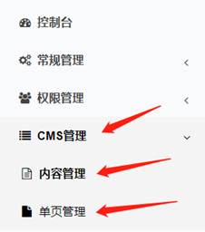

内容管理页面默认没有内容，但存在4个栏目：文章栏目和其下的3个子栏目公告、今日推荐与资讯。

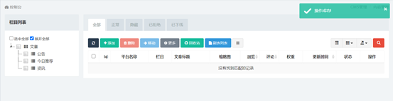

用户点击该页面上方的添加按钮即可为打开添加页面。栏目ID仅能从目前存在的3个子栏目公告、今日推荐与资讯中选择。

可添加的字段如下：

基础信息部分

栏目ID：该字段代表要添加的内容使用的栏目的栏目名称，用户需在下拉菜单的所有栏目中任选一个栏目。

发布会员：默认值为空，该字段代表要添加的内容的发布会员，可为空。

文章标题：默认值为空，该字段代表要添加的内容的文章标题，如不填写则会提示“文章标题不能为空”导致添加失败。

缩略图：默认值为空，该字段代表要添加的内容的缩略图。用户可点击右侧上传按钮上传图片或直接填入图片链接地址。

TAG：默认值为空，该字段代表要添加的内容的标签。用户可以手动输入或或点击右侧箭头在下拉菜单中选择预设的标签。

自定义URL：默认值为空，该字段代表要添加的内容的自定义URL，若为空将自动使用主键ID。

内容：默认值为空，该字段代表要添加的内容，用户可使用富文本编辑器辅助编辑。如不填写则会提示“内容不能为空”导致添加失败。

关键字：默认值为空，该字段代表要添加的内容的关键字。

描述：默认值为空，该字段代表要添加的内容的描述。

相关信息部分

浏览：默认值为0，仅允许填入数字，填入小于0的数字保存后会自动重置回0。该字段代表要添加的内容的被浏览次数。

评论：默认值为0，仅允许填入数字，填入小于0的数字保存后会自动重置回0。该字段代表要添加的内容的被评论次数。

点赞：默认值为0，仅允许填入数字，填入小于0的数字保存后会自动重置回0。该字段代表要添加的内容的被点赞次数。

点踩：默认值为0，仅允许填入数字，填入小于0的数字保存后会自动重置回0。该字段代表要添加的内容的被点踩次数。

状态部分

标志：默认值为没有选中任何项，该字段表示要添加的内容的标志，点击右侧箭头在下拉菜单中预设的三个标志热门、NEW、推荐中可以选择一项或多项。

状态：默认值为正常，该字段表示要添加的内容的状态，仅可在通过点击右侧箭头在下拉菜单中出现的预设的四个状态正常、隐藏、已拒绝、以下线中选择。

发布：默认值为当前日期的00:00:00，该字段表示要添加的内容的发布时间，仅支持时间格式。

所有信息填写完毕后点击“确认”即完成添加，点击重置则会清空该页面所有已填写信息。

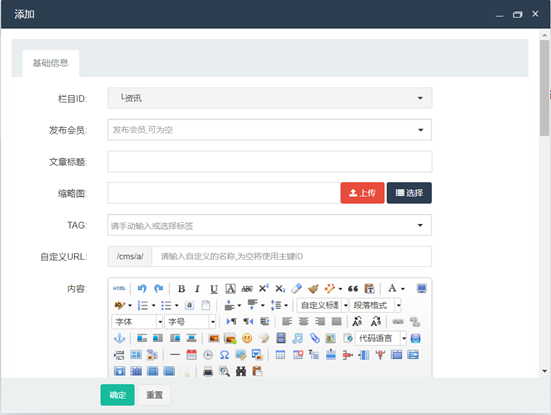

添加成功后，内容管理页面即会增加一行新的CMS内容信息。点击该行信息最右侧的操作按钮可对该信息进行修改或删除。

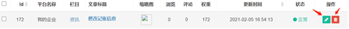

点击绿色的修改按钮后，进入编辑页面可进行修改编辑。

可修改字段除以下两点外，字段含义和限制均与可添加字段中对各字段的介绍相同：

1、各字段默认值为要修改的内容添加时用户填入或选择的值。

2、增加可供修改的新字段权重，该字段仅允许填入数字，该字段代表在内容管理页面中该内容的权重值，权重值越高的内容在内容管理表格中出现得越靠前。

修改结束后后点击“确认”即完成修改，点击重置则会将所有已修改信息重置为修改前状态。

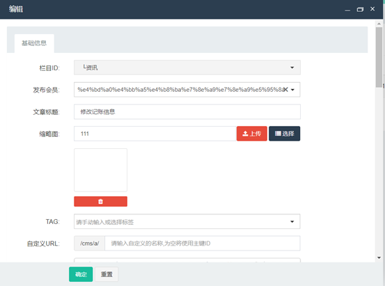

点击删除则会出现提示窗口进行确认，点击确定即可删除所选协作者的账号，点击取消则会取消这次删除。

单页管理页面默认没有内容，但存在1个默认类型page

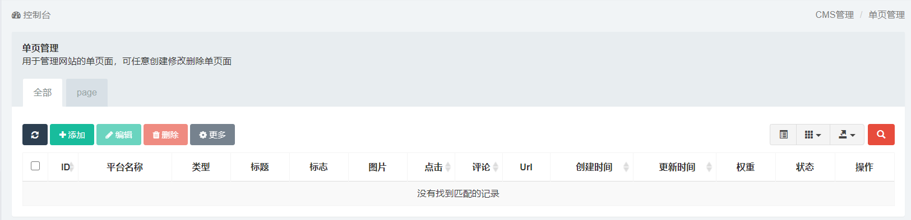

用户点击该页面上方的添加按钮即可为打开添加页面，可添加的字段如下：

类型：默认值为空，该字段代表要添加的单页的类型。用户可以手动填写自定义类型或或点击右侧箭头在下拉菜单中选择预设的类型page。如不填写则会提示“类型不能为空”导致添加失败。

标题：默认值为空，该字段代表要添加的单页的标题。如不填写则会提示“标题不能为空”导致添加失败。

关键字：默认值为空，该字段代表要添加的单页的关键字。

描述：默认值为空，该字段代表要添加的单页的描述。

标志：默认值为没有选中任何项，该字段表示要添加的单页的标志，点击右侧箭头在下拉菜单中预设的三个标志热门、首页、推荐中可以选择一项或多项。

图片：默认值为空，该字段代表要添加的单页的图片。用户可点击右侧上传按钮上传图片或直接填入图片链接地址。

内容：默认值为空，该字段代表要添加的内容，用户可使用富文本编辑器辅助编辑。

自定义：默认值为空，该字段代表要添加的单页的自定义内容。如不填写则会提示“自定义不能为空”导致添加失败。

视图模板：默认值为空，该字段表示要添加的单页使用的视图模板。用户可自行填写以page开头的自定义模板文件名或点击右侧箭头在下拉菜单中选择预设的模板文件page.html。

权重：默认值为0，该字段仅允许填入数字，该字段代表在单页管理页面中该单页的权重值，权重值越高的单页在单页管理表格中出现得越靠前。

状态：默认值为正常，该字段代表要添加的单页的状态，仅能在正常和隐藏2个选项中进行选择。

所有信息填写完毕后点击“确认”即完成添加，点击重置则会清空该页面所有已填写信息。

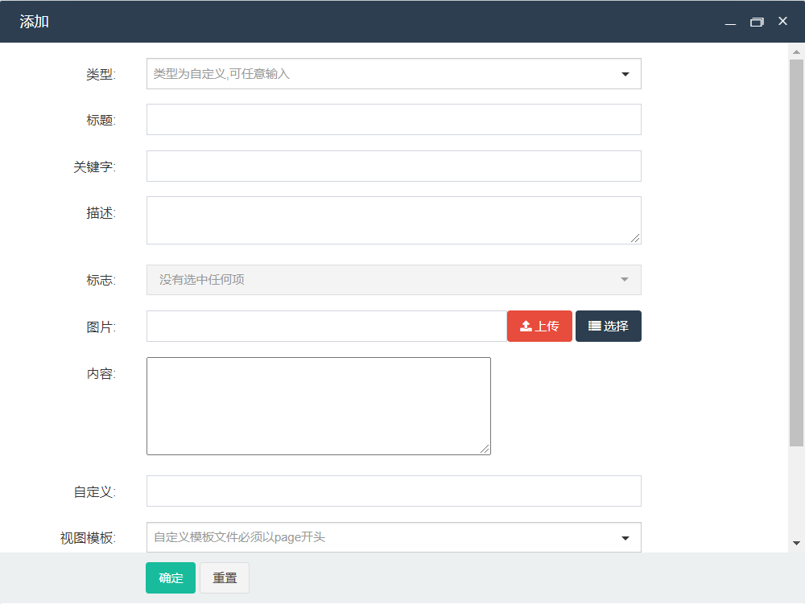

添加成功后，单页管理页面即会增加一行新的单页信息。点击该行信息最右侧的操作按钮可对该信息进行修改或删除。

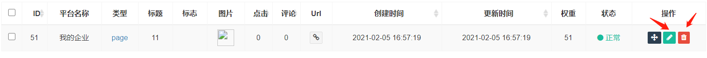

点击绿色的修改按钮后，进入编辑页面可进行修改编辑。

可修改字段除以下两点外，字段含义和限制均与可添加字段中对各字段的介绍相同：

1、各字段默认值为要修改的单页添加时用户填入或选择的值。

2、增加如下可供修改的新字段：

点击：默认值为0，仅允许填入数字，填入小于0的数字保存后会自动重置回0。该字段代表要修改的单页的被点击次数。

评论：默认值为0，仅允许填入数字，填入小于0的数字保存后会自动重置回0。该字段代表要修改的单页的被评论次数。

修改结束后后点击“确认”即完成修改，点击重置则会将所有已修改信息重置为修改前状态。

点击删除则会出现提示窗口进行确认，点击确定即可删除所选协作者的账号，点击取消则会取消这次删除。

▶ 开发者协作者使用流程

## 1 概述

开发者协作者账号为开发者用户所创建，具体创建流程请参见开发者使用流程第4部分“协作者与测试账号管理”。开发者协助者通过开发者创建账号时设定的用户名和密码即可于TTFGame平台首页进行登录。同时，开发者协作者因权限较低对大部分页面仅有查看权限，关于这些页面的详细说明请参见各页面介绍中对这些页面的说明，此部分中不再赘述。

## 2 账号注册与过审

开发者协作者账号不需要注册，请向需要协作的开发者用户索要登录平台所使用的用户名与密码。

新账号登录平台时，会因为账号未审核进入控制台页面时收到提示，点击“立即前往完善资料”即会跳转至账号信息页面。

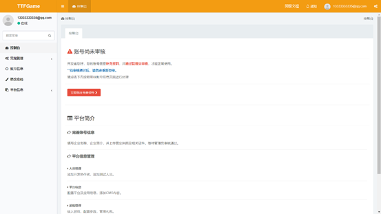

账号信息页面中用户需要编辑自己的企业名称，企业简介并上传营业执照。完善信息后点击下方的确定按钮后即发起了审核申请，待管理员确认审核信息后，会通过发送公告的方式给出相应的审核结果与审核建议，审核未通过时请根据审核建议重新提交审核，审核通过后用户即可开始正式使用TTFGame平台。

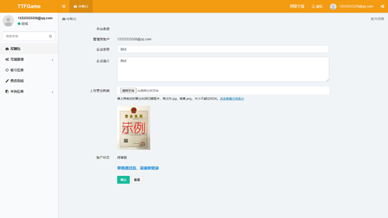

## 3 修改密码

通过审核后重新登录后，用户会来到控制台页面，用户可以通过点击左侧的导航栏在在各个页面间进行切换。点击左侧导航栏中的“修改密码”进入修改密码界面。

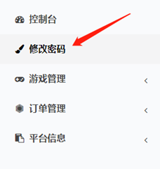

在密码栏和确认密码栏连续输入同样的新密码后点击“确定”即修改密码成功，点击“重置”则放弃修改继续使用修改前的密码。特别的，在本页面修改密码后用户会被强制退出平台，请使用新密码重新进行登录。

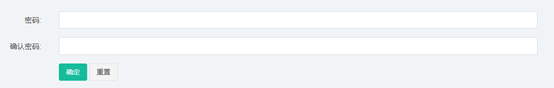

## 4 游戏创建与发布

用户可以通过点击左侧的导航栏点击游戏管理栏将其展开，再在展开部分中选择游戏管理进行添加游戏与发布操作。

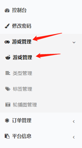

游戏管理页面默认没有游戏，用户点击该页面上方的添加按钮即可为自己的平台添加游戏。

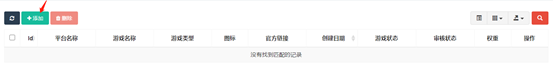

可添加的字段如下：

游戏名称：默认值为空，该字段代表新创建游戏的游戏名称。如不填写则会提示“游戏名称不能为空”导致添加失败。

官方链接：默认值为空，该字段代表新创建游戏的官方链接。如不填写则会提示“官方链接不能为空”导致添加失败。如不填写有效的URL地址则会提示“链接不是有效的URL地址”导致添加失败。**这里地址必须是游戏入口实际地址。**

游戏类型：该字段代表新创建游戏的游戏类型，用户需要下拉菜单中从全平台公有的游戏类型和游戏所属平台专有的游戏类型中选择任一类型。

APP类型：默认值为H5，该字段代表新创建的游戏的APP类型，仅能在H5和APP两个选项中进行选择。**只有选择H5的时候可以直接进入游戏，否则将会跳转到浏览器页面展示官方链接地址。**

重要标签：默认值为热门、最新、推荐三个标签均为未添加状态，该字段代表新创建的游戏所使用的重要标签，通过点击对应标签可以添加对应的重要标签。允许不添加或添加一到多个重要标签。

标签：默认值为空，可以手动输入或在全平台公有的标签和游戏所属平台专有的标签中进行选择。该字段代表新创建的游戏三个重要标签外使用的其他标签，允许不添加或添加一到多个。

图标：默认值为空。该字段代表所创建游戏所使用的图标，用户可点击右侧上传按钮上传图片或直接填入图片链接地址。上传图片尺寸需为512\*512px,格式必须为JPG或PNG，若不符合要求则会出现报错提示。如不添加则会提示“图标不能为空”导致添加失败。

推广图：默认值为空。该字段代表所创建游戏主要作为游戏详情页置顶图所使用的推广图，用户可点击右侧上传按钮上传图片或直接填入图片链接地址。上传图片尺寸需为1024\*500px,格式必须为JPG或PNG，若不符合要求则会出现报错提示。如不添加则会提示“推广图不能为空”导致添加失败。

游戏状态：默认值为开放，该字段代表新创建的游戏的游戏状态，仅能在开放、敬请期待、预约和测试四个选项中进行选择。**其中，只有开放状态可以在用户客户端App中看到，而测试状态可以在测试客户端App中看到。敬请期待和预约暂时都未在客户端展示。**

是否横屏：默认值为否，该字段代表新创建游戏是否为横屏游戏，点击即可切换为是。**这是是否在App端横屏展示游戏的唯一依据。**

简介：默认值为空，该字段代表新创建游戏的简介，如不填写则会提示“简介不能为空”导致添加失败。

游戏详情：默认值为空，该字段代表新创建游戏的游戏详情，如不填写则会提示“游戏详情不能为空”导致添加失败。

截图：默认值为空。该字段代表所创建游戏的截图，至少需要上传5场或以上，用户可点击右侧上传按钮上传图片或直接填入图片链接地址（填入多个地址时中间需要以逗号分隔）。上传图片的建议尺寸为横板游戏1280\*720px以上，竖板游戏720\*1280px以上,格式必须为JGP或PNG，若不符合要求则会出现报错提示。如不添加则会提示“截图不能为空”导致添加失败。如上传图片数量不足则会提示“上传图片数量不足5张”导致添加失败。

所有信息填写完毕后点击“确认”即完成添加，点击重置则会清空该页面所有已填写信息。

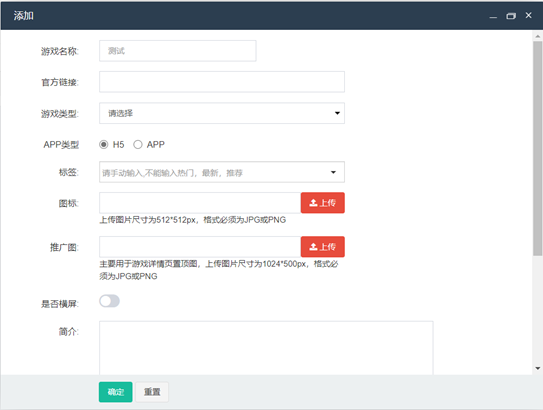

添加成功后，游戏为未开放待审核状态。协作者管理页面即会增加一行新的游戏信息。点击改行信息最右侧的操作按钮可对该信息进行详情查看，审核信息查看，编辑和删除。

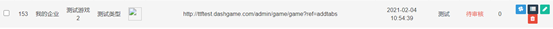

等待审核通过后，审核状态由待审核变为审核通过并额外增加发布按钮，点击即可进行游戏发布，对已发布的游戏再次点击即为游戏撤回重新变为未发布状态。

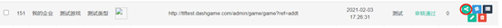

▶ 各页面介绍

## 1 控制台

初始页面。通过本页面可获取权限许可内的实时数据和当前的服务器信息。

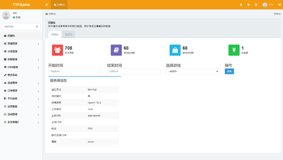

同时，也支持进行浏览量与启动量的查询并生成相对应的图表。

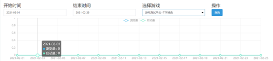

## 2 常规管理

开发者仅可使用常规管理下的个人配置页面，开发者协作者不支持使用常规管理下的任何页面。

### 2.1 个人配置

该页面管理员与开发者可使用，分为左侧个人配置与右侧操作日志两个部分。

个人配置部分中用户可获取个人信息，同时允许用户对除用户名之外的信息进行修改。

操作日志部分中仅允许用户查看在本平台中进行的所有操作信息，不支持增删改查。

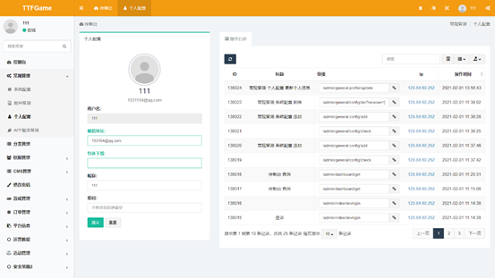

## 3 权限管理

开发者可使用权限管理下的部分分页，开发者协作者不可使用权限管理。

### 3.1 协助者管理

该页面开发者可使用。

开发者则仅能获取自己及其名下的开发者协作者的信息。

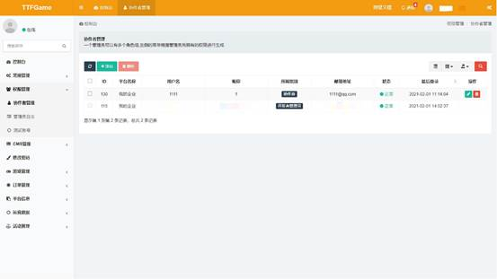

### 3.2 管理员日志

该页面开发者可使用。平台用户可通过该页面根据自己的权限查看对应的管理员日志。

开发者则仅能获取自己及其名下的开发者协作者的日志信息。

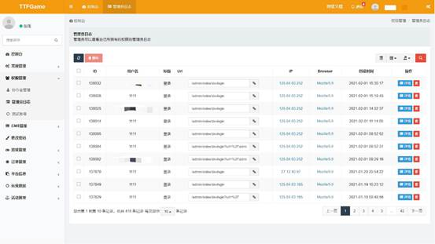

日志信息允许用户进行查询与删除操作，不允许进行添加与修改操作。

### 3.3 测试账号

该页面开发者可使用。平台用户可通过该页面根据自己的权限查看对应的测试账号信息。

开发者仅可查看其所属平台的测试账号。

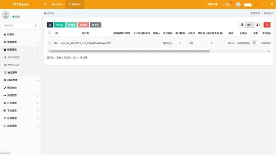

## 4 CMS管理

开发者仅可使用CMS管理下的部分页面，开发者协作者不可使用CMS管理。

### 4.1 内容管理

该页面开发者可使用。平台用户可根据自身权限于本页面查看各个栏目下的文章列表。

开发者仅能查看管理自身平台下的栏目中的文章。

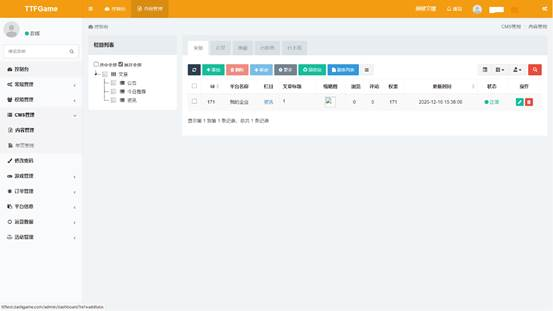

### 4.2 单页管理

该页面开发者可使用。平台用户可根据自身权限于本页面查看管理网站中的单页面。

开发者仅可查看管理自身平台下的单页。

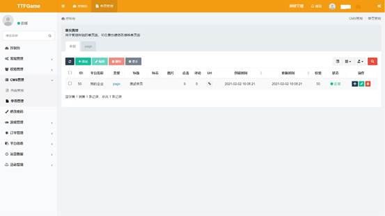

## 5 修改密码

该页面中用户可以修改新的登录密码。

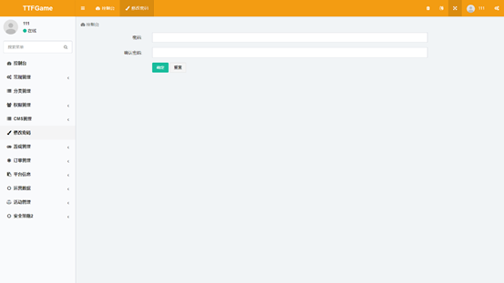

## 6 游戏管理

开发者可使用游戏管理下的所有页面。开发者协作者仅可使用游戏管理下的部分页面。

### 6.1 游戏接入

该页面开发者可使用。通过该页面用户可以查看并管理游戏接入信息。仅支持用户进行搜索，修改和删除操作，不支持添加操作。

开发者仅能查看管理自己平台游戏的游戏接入信息，支持查看游戏的相关审核信息。

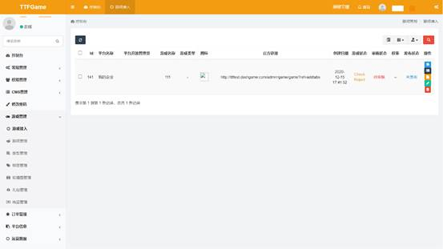

### 6.2 游戏管理

该页面所有平台用户皆可使用。通过本页面用户可查看管理游戏信息。

开发者与开发者协作者仅可查看管理自己平台游戏的游戏信息，同时支持对这些游戏的发布与撤回。

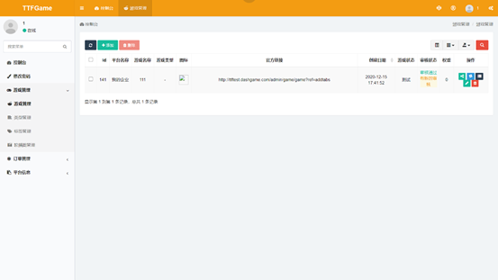

### 6.3 类型管理

该页面所有平台用户皆可使用。通过本页面用户可查看管理游戏类型信息。

开发者仅可查看管理自己平台游戏的类型信息。

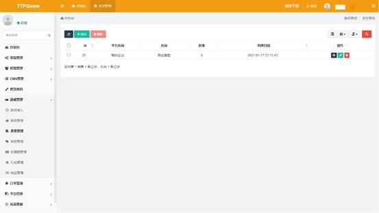

开发者协作者仅可查看自己所协作的开发者的平台的游戏的游戏类型信息，不支持添加，修改和删除。

### 6.4 标签管理

该页面所有平台用户皆可使用。通过本页面用户可查看游戏标签信息，不支持添加，修改和删除。

开发者与开发者协作者仅可查看自己平台游戏的游戏标签信息。

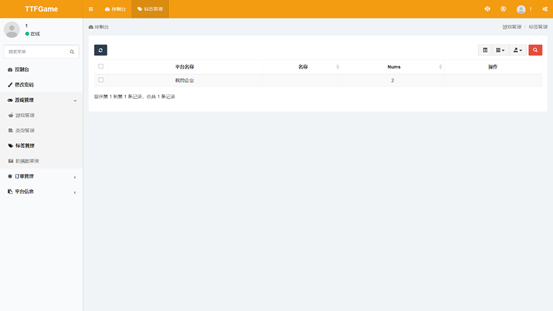

### 6.5 轮播图管理

该页面所有平台用户皆可使用。通过本页面用户可查看管理轮播图信息。

开发者仅可查看管理自己平台游戏的轮播图信息。

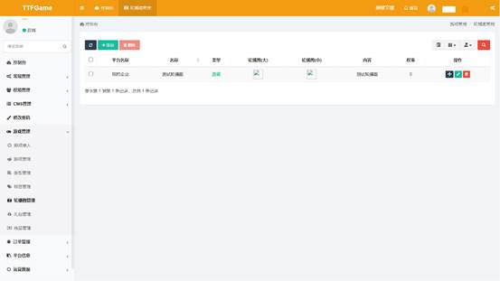

开发者协作者仅可查看自己所协作的开发者的平台的游戏的轮播图信息，不支持添加，修改和删除。

### 6.6 礼包管理

本页面开发者可使用。通过本页面用户可查看管理游戏礼包信息。

开发者仅可查看管理自己平台游戏的礼包信息。

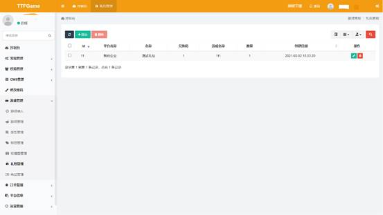

### 6.7 商品管理

本页面开发者可使用。通过本页面用户可查看管理游戏商品信息。

开发者仅可查看管理自己平台游戏的商品信息。

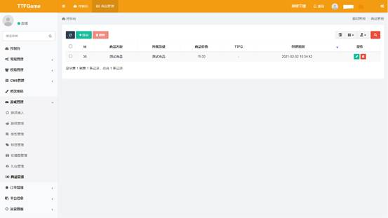

## 7 订单管理

开发者和开发者协作者仅可使用订单管理下的部分页面。订单管理下的所有页面均只支持用户查看或搜索，不支持添加修改和删除操作。

### 7.1 提币订单

本页面开发者可使用。通过本页面用户可查看提币订单信息。

开发者仅能查看自己平台的提币订单信息。

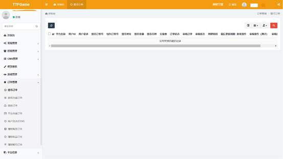

### 7.2 游戏充值订单

本页面所有用户均可使用。通过本页面用户可查看游戏充值订单信息。

开发者与开发者协作者仅能查看自己平台的游戏充值订单信息。

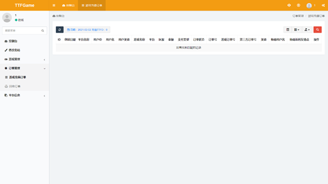

### 7.3 回收订单

本页面所有用户均可使用。通过本页面用户可查看回收订单信息。

开发者与开发者协作者仅能查看自己平台的回收订单信息。

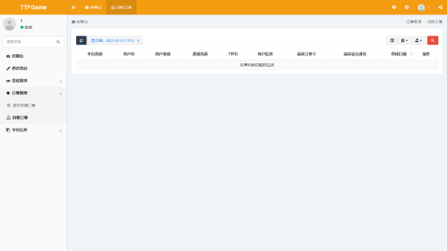

### 7.4 平台充值订单

本页面管理员，管理员协作者与开发者均可使用。通过本页面用户可查看平台充值订单信息。

开发者仅能查看自己平台的平台充值订单信息。

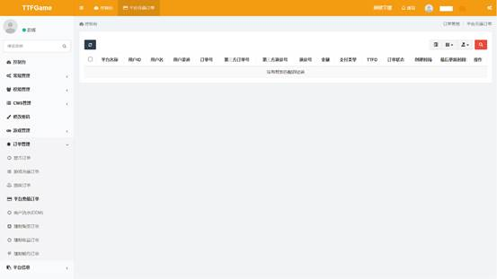

### 7.5 商户流水（DDM）

本页面开发者可使用。通过本页面用户可查看商户流水(DDM)信息。

开发者仅能查看自己平台的商户流水(DDM)信息。

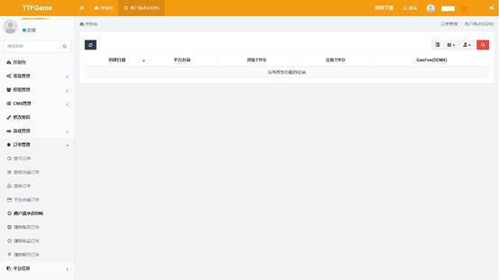

### 7.6 理财购买订单

本页面开发者可使用。通过本页面用户可查看理财购买订单信息。

开发者仅能查看自己平台的理财购买订单信息。

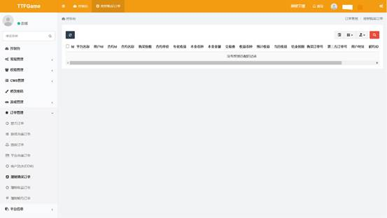

### 7.7 理财收益订单

本页面开发者可使用。通过本页面用户可查看理财收益订单信息。

开发者仅能查看自己平台的理财收益订单信息。

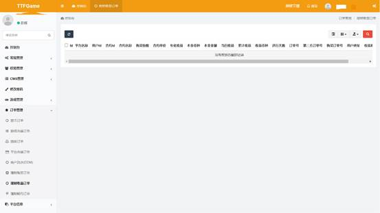

### 7.8 理财解约订单

本页面开发者可使用。通过本页面用户可查看理财解约订单信息。

开发者仅能查看自己平台的理财解约订单信息。

## 8 平台信息

开发者和开发者协作者仅可使用平台信息下的部分页面。

### 8.1 平台通知

本页面所有用户均可使用。通过本页面用户可以查看与管理平台通知，同时支持用户根据权限的不同进行平台通知的发送或接收操作。

开发者与开发者协作者可通过本页面接收平台通知。开发者使用本页面仅支持搜索，不支持添加，修改与删除操作。

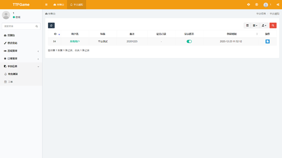

### 8.2 开发者处罚记录

本页面开发者可使用。通过本页面用户根据权限不同可查看或管理开发者处罚记录信息。

开发者通过该页面仅可查看自己的处罚记录。开发者使用本页面仅支持搜索，不支持添加，修改与删除。

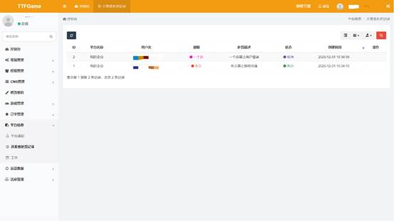

### 8.3 工单

本页面所有用户均可使用。因目前系统不支持处理工单，用户需点击“前往工单系统”按钮跳转至新的系统中继续进行操作。

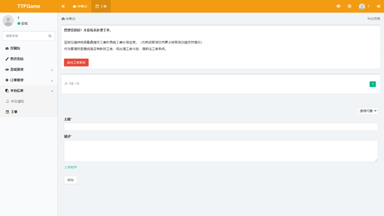

## 9 运营数据

开发者可使用运营数据下的部分页面，开发者协作者不支持使用运营数据下的任何页面。运营数据下只支持搜索，不支持添加，修改和删除。

### 9.1 会员管理

本页面管理员，管理员协作者与开发者均可使用。通过本页面用户可以查看管理会员信息。

管理员与管理员协作者可以查看和管理所有平台的会员信息。

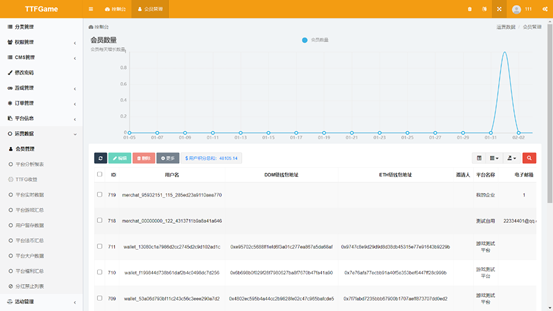

开发者仅可查看和管理自己平台的会员信息。

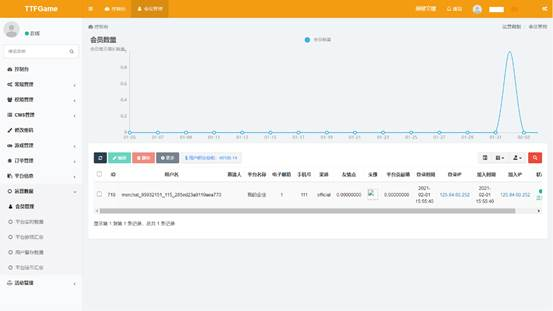

### 9.3 平台实时数据

本页面开发者可使用。通过本页面用户可以查看平台实时数据信息。

开发者仅可查看自己平台的实时数据信息。

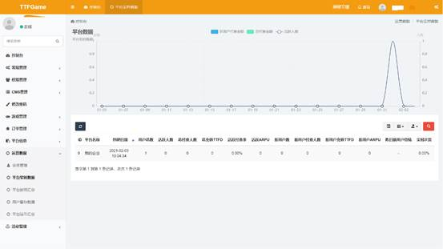

### 9.5 平台游戏汇总

本页面开发者可使用。通过本页面用户可以查看平台游戏汇总信息。

开发者仅可查看自己平台的游戏汇总信息。

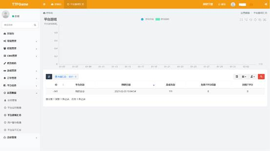

### 9.6 用户留存数据

本页面开发者可使用。通过本页面用户可以查看用户留存数据信息。

开发者仅可查看自己平台用户的留存数据信息。

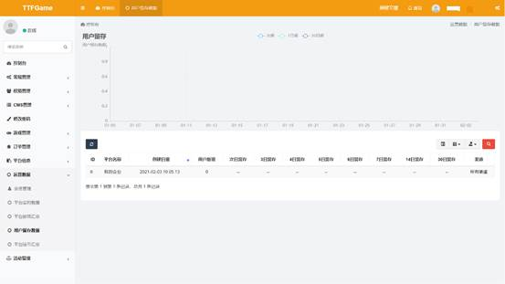

### 9.7 平台法币汇总

本页面开发者可使用。通过本页面用户可以查看平台法币汇总信息。

开发者仅可查看自己平台的法币汇总信息。

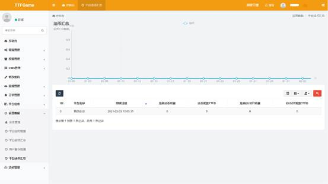

## 10 活动管理

开发者可使用活动管理下的部分页面，开发者协作者不支持使用活动管理下的任何页面。

### 10.1 合约管理

本页面开发者可使用。过本页面用户可以查看和管理合约信息。

开发者仅能查看管理自己平台的合约信息。

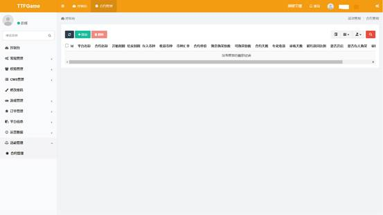
